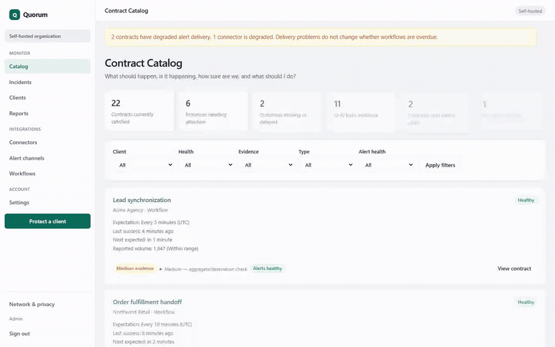

# Quorum

[Website](https://quorumwatch.com) · [GitHub](https://github.com/werniq/quorum_core)

Define what each critical workflow should do. Quorum checks whether it ran, whether its reported volume stayed within the expected range, and how strong the evidence actually is.

Quorum watches n8n workflows against explicit contracts. You define when a workflow should report in, what counts as success or failure, and how strong the evidence needs to be. Quorum opens incidents when reality drifts from that contract and resolves them when reporting recovers.

n8n can show a green execution while the business outcome is wrong — or a workflow can stop entirely and nothing tells you the process is down. Quorum is a self-hosted Contract Catalog with polling, push heartbeats, incidents, and alerts.

Open source, zero telemetry, and designed so your workflow data can stay in your infrastructure. Reliability evidence that protects client retainers and supports proactive maintenance reporting.

Quorum shows what your n8n workflows are expected to do, whether reported volume stayed inside declared bands, and alerts you when they fail, stop reporting, or produce an unacceptable result.

[](docs/demo/quorum-demo.mp4)

## Features

- **Contract Catalog** — health, evidence strength, deadlines, and alert status
- **n8n polling** — URL + API key; no workflow changes
- **Push heartbeats** — signed reports from n8n for richer detail
- **Incidents and alerts** — silent absence, hard failures, volume drift; webhook or SMTP
- **Simplified onboarding** — connect n8n, select workflows, confirm expectations, start monitoring

## Beta status

Quorum Community is **beta** software for self-hosted design partners. Expect rough edges — see [limitations](#limitations). **Hosted multi-tenant SaaS is not available** from this repository.

Design-partner kit: [lifecycle screenshot](docs/screenshots/lifecycle.png) · [push vs polling](docs/push-vs-polling.md) · [Poll invoices example](docs/demo/poll-invoices-example.md) · [Beta feedback](.github/ISSUE_TEMPLATE/beta-feedback.yml) issue template · [demo index](docs/demo/README.md).

**Licence:** [Apache-2.0](LICENSE) — Quorum Community only. Quorum Cloud (hosted SaaS) is separate proprietary code outside this tree.

## Quick start (Docker)

Published image: [`qniw984/quorum:0.1.0-beta.13`](https://hub.docker.com/r/qniw984/quorum/tags) (Compose default).

```bash
git clone https://github.com/werniq/quorum_core.git
cd quorum_core
cp .env.example .env
# Edit the required secrets: QUORUM_CREDENTIAL_KEK (min 16 chars)
# and QUORUM_SETUP_TOKEN (min 24 chars when auth is on)
docker compose up -d
```

Open [http://127.0.0.1:3000/](http://127.0.0.1:3000/), create the admin at `/setup`, then **Set up monitoring**.

More detail: [docs/getting-started.md](docs/getting-started.md). Environment: [docs/environment.md](docs/environment.md).

### Develop from source (build locally)

```bash
docker compose -f docker-compose.yml -f docker-compose.dev.yml up --build -d
```

## Connect n8n

**Polling (recommended):** in Quorum, open **Set up monitoring**, connect n8n with URL + API key, select workflows, confirm expectations, start monitoring. No n8n workflow edits.

**Push heartbeats:** register a push workflow, issue a credential, activate, then import [examples/n8n/quorum-signed-heartbeat.json](examples/n8n/quorum-signed-heartbeat.json).

Full setup: [docs/connect-n8n.md](docs/connect-n8n.md) · [docs/push-heartbeats.md](docs/push-heartbeats.md) · [examples/n8n/README.md](examples/n8n/README.md).

## Security and operations

- No telemetry in self-hosted mode; session cookies and CSRF on HTML forms
- Credentials encrypted under `QUORUM_CREDENTIAL_KEK` — **back up the KEK separately from the database**
- Health: `GET /healthz`, `/readyz`, `/health/watcher` (uptime checks should use `/health/watcher`)

More: [docs/security.md](docs/security.md) · [docs/operations.md](docs/operations.md) · [docs/incident-api.md](docs/incident-api.md) · [SECURITY.md](SECURITY.md)

## Limitations

Heartbeat and volume-band evidence can be self-reported. They do not independently prove destination delivery. Basic incident acknowledgement and post-recovery review are supported; advanced triage (assignment, severity edits, response targets) remains incomplete. HubSpot → Zoom outcome path is **Preview** only; no hosted SaaS / billing in this Community tree. Contract Catalog, push heartbeats, and polling are **Available**. Zapier / Make and general outcome verification for all workflows are **Planned**. Full list: [docs/known-limitations.md](docs/known-limitations.md).

## Development

Requires Node **20+**.

```bash
npm ci
npm run typecheck
npm test
npm run build
npm run dev
```

Full self-hosted gate: `npm run verify:self-hosted`. Docs index: [docs/getting-started.md](docs/getting-started.md).
