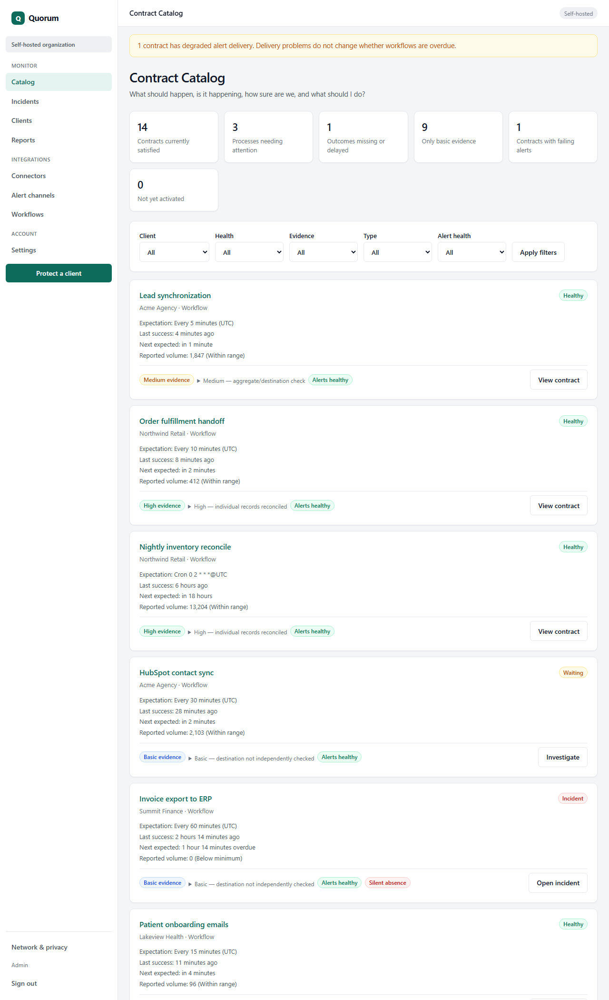
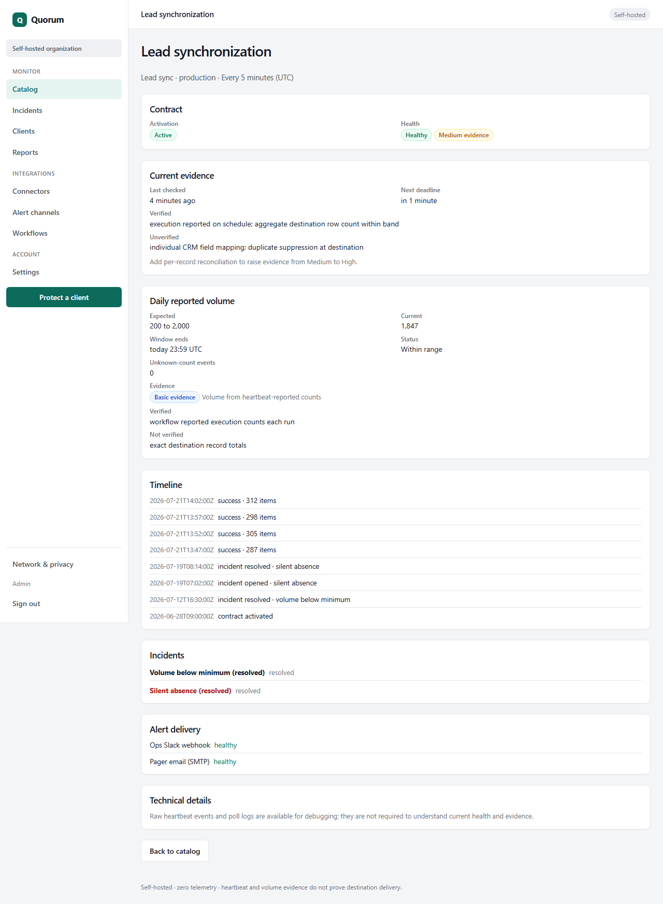
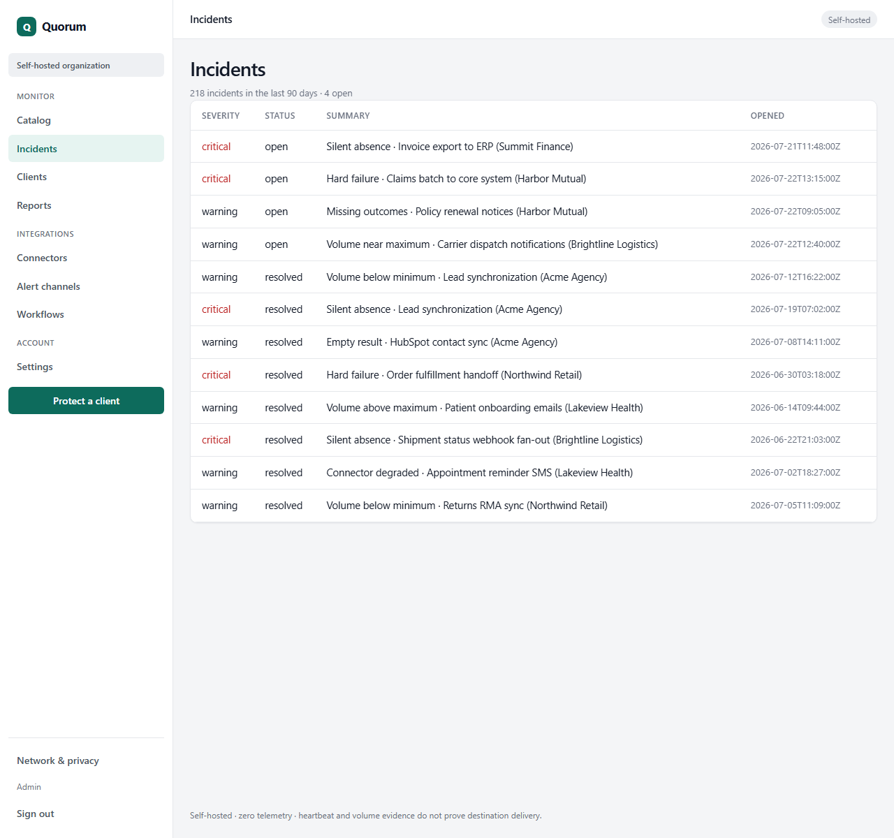
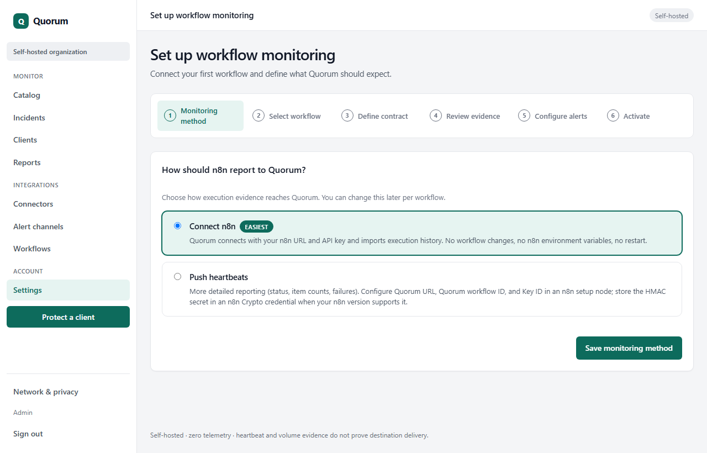

# Quorum

Define what each critical workflow should do. Quorum checks whether it ran, whether its reported volume stayed within the expected range, and how strong the evidence actually is.

Quorum watches n8n workflows against explicit contracts. You define when a workflow should report in, what counts as success or failure, and how strong the evidence needs to be. Quorum opens incidents when reality drifts from that contract and resolves them when reporting recovers.

**Quick links:** [How it works](#how-it-works) · [Quick start](#quick-start-docker) · [Protect a client](#protect-a-client) · [Connect n8n](#connect-n8n) · [Alerts](#alerts) · [Security](#security) · [Backup](#backup-and-upgrades) · [Health](#health-endpoints) · [Development](#development) · [Limitations](#limitations) · [n8n heartbeat example](examples/n8n/) · [Architecture](docs/architecture.md) · [Contributing](CONTRIBUTING.md) · [Security policy](SECURITY.md)

## The silent-failure problem

n8n can show a green execution while the business outcome is wrong: the workflow ran but sent too few rows, too many rows, or nothing at all. Worse, a workflow can stop running entirely and nothing in n8n tells you the business process is down.

Quorum is for teams running scheduled or event-driven n8n workflows who need a separate check on **whether the process is still happening on time** and **whether reported volume looks sane**. It is a self-hosted Contract Catalog with push heartbeats, optional n8n polling, incidents, and alerts.

Open source, zero telemetry, and designed so your workflow data can stay in your infrastructure. Reliability evidence that protects client retainers and supports proactive maintenance reporting.

Quorum shows what your n8n workflows are expected to do, whether reported volume stayed inside declared bands, and alerts you when they fail, stop reporting, or produce an unacceptable result.

Quorum detects:

- **Silent absence** when expected heartbeats or poll imports stop arriving
- **Hard failures** when a workflow reports failure
- **Volume drift** when reported item counts fall outside configured bands (Basic evidence only; see limitations)
- **Stale or missing evidence** relative to the contract deadline
- **Alert delivery problems** separately from workflow health



## How it works

**Contracts** tie a registered workflow to a cadence, evidence level, volume rules (optional), and alert routes. The Contract Catalog is the main surface: health, evidence strength, next deadline, and alert channel status in one place.

**Polling** (easiest) imports finished executions from n8n on a schedule. You add an n8n connector (URL + API key), register the workflow with method **Connect n8n**, and bind the connector in the UI — no workflow changes and no n8n environment variables.

**Push heartbeats** are signed HTTP reports from a step at the end of your n8n workflow for more detailed reporting (status, item counts, failures). Quorum verifies HMAC, timestamp, and idempotency before recording evidence. Configure Quorum URL, Quorum workflow ID, and Key ID in one n8n setup node; store the HMAC secret in an n8n Crypto credential when your version supports it.

**Incidents** open when the watcher finds a breach: silent absence, failure status, volume out of range, and similar contract violations. Each incident has a severity and summary.

**Alerts** deliver incident and resolution events through webhook or SMTP channels you configure. Failed deliveries surface in the catalog banner and on contract cards without changing whether a contract is overdue.

**Recovery** resolves open incidents when valid evidence arrives again (for example after you fix n8n and heartbeats resume).







## Beta status

Quorum Community is **beta** software for self-hosted design partners. Expect rough edges, incomplete triage UI, and gaps listed below. Hosted multi-tenant SaaS is **not available** from this repository and is not production-ready.

**Licence:** [Apache-2.0](LICENSE)

Quorum Community (this repository) is licensed under the Apache License 2.0. Quorum Cloud (hosted SaaS) is separate proprietary code outside this repository — not a fork of this license.

## Quick start (Docker)

First-time install:

```bash
cp .env.example .env
```

Edit `.env` and set at least:

| Variable                 | Required                     | Notes                                                                                                                                                                                                |
| ------------------------ | ---------------------------- | ---------------------------------------------------------------------------------------------------------------------------------------------------------------------------------------------------- |
| `QUORUM_CREDENTIAL_KEK`  | Yes                          | Long random secret (min 16 characters). Encrypts push credentials and similar secrets. **Back it up separately from the database** — without it you cannot decrypt stored credentials after restore. |
| `QUORUM_SETUP_TOKEN`     | When UI auth is on (default) | One-time bootstrap token (min 24 characters). Used only at `/setup`. **Not** the admin password.                                                                                                     |
| `QUORUM_UI_AUTH_ENABLED` | Defaults to `true`           | Setup token + login. Set `false` for a local open UI without login.                                                                                                                                  |
| `QUORUM_DEMO_MODE`       | Optional                     | `true` opens the UI without login, but only when `HOST` is localhost (`127.0.0.1` / `localhost` / `::1`). Rejected with `0.0.0.0` — do not enable it in the default Docker compose bind.             |
| `PUBLIC_BASE_URL`        | Recommended                  | e.g. `http://127.0.0.1:3000`.                                                                                                                                                                        |
| `QUORUM_HOST_PORT`       | Optional                     | Host port if `3000` is already taken.                                                                                                                                                                |

```bash
docker compose up --build -d
```

Open [http://127.0.0.1:3000/](http://127.0.0.1:3000/).

### First-time setup

**Auth on (default):** set `QUORUM_SETUP_TOKEN` (≥24 characters), visit `/setup`, create the local admin, then use the UI (onboarding or **Protect a client**).

The admin **password** is not the setup token. It must be ≥12 characters and must not be an exact match (case-insensitive) of a known default such as `password`, `changeme`, or `quorum123`. There is no charset or entropy score requirement beyond that. A rejected password shows as `weak_password` (with a clearer message on the setup form).

**Open UI:** `QUORUM_UI_AUTH_ENABLED=false`, or `QUORUM_DEMO_MODE=true` on a localhost bind — open `/` or `/catalog` without login.

There is no default password. When auth is on and you omit `QUORUM_SETUP_TOKEN`, a one-time token may appear in container logs on first boot. Prefer supplying your own token.

## Protect a client

End-to-end path for a real client after Quorum is up. Use **Protect a client** in the UI (`/protect`). Steps use **Continue** (and **Back** where shown); selecting an existing client or workflow continues with that record — it does not create a duplicate.

### 1. Create or select the client

1. Open **Protect a client**.
2. Choose an **existing client** from the list, or leave that blank and enter a **new client name**.
3. Click **Continue**.

Do not create a second client for the same agency relationship unless you mean to. Selecting an existing client and continuing is the normal path.

### 2. Identify the process, then register (or reuse) the workflow

Continue through the process/template step (templates prefill questions; they do **not** activate a contract).

On **Select a workflow**:

- Prefer **Existing registered workflow** when the n8n workflow is already in Quorum (from **Workflows** or an earlier Protect run). Selecting it continues with that Quorum id — it does **not** re-register.
- Only use **Register new…** when you need a new Quorum registration.

Two different IDs matter (plus credential fields for push):

| ID                     | Where it comes from                                                                                | Used for                                                                    |
| ---------------------- | -------------------------------------------------------------------------------------------------- | --------------------------------------------------------------------------- |
| **n8n workflow ID**    | n8n URL: `…/workflow/{id}`                                                                         | Registration field “n8n workflow ID” / external id                          |
| **Quorum workflow ID** | Assigned by Quorum (shown on **Workflows**, Protect flash, credential page, URL `/workflows/<id>`) | Push setup node / advanced env `QUORUM_WORKFLOW_ID`                         |
| **Key ID**             | Quorum “Issue push credential”                                                                     | Push setup node / advanced `QUORUM_KEY_ID`                                  |
| **HMAC secret**        | Shown once with the credential                                                                     | n8n Crypto credential or Crypto HMAC Secret / advanced `QUORUM_HMAC_SECRET` |

Monitoring method: choose **Connect n8n** (easiest — URL + API key, no workflow changes) unless you need push detail.

You can also register first on **Workflows**, then pick that workflow in Protect. Inactive on **Workflows** means there is no active contract yet — use the next-step hint to define and activate.

### 3. Issue a push credential (push only)

On **Workflows**, for a push workflow, click **Issue push credential**. Quorum shows **Key ID** and **HMAC secret** once. Copy them immediately; the secret is not shown again.

Paste into the n8n **Quorum Setup (edit me)** node and Crypto HMAC / Crypto credential (see [examples/n8n/README.md](examples/n8n/README.md)). Advanced fleets may map the same values to process env: `QUORUM_KEY_ID`, `QUORUM_HMAC_SECRET`, plus `QUORUM_WORKFLOW_ID` (Quorum id, not the n8n URL id).

Credentials alone do **not** activate monitoring. The credential page links next to Protect for contract + activate.

### 4. Define the contract and activate

A registered workflow stays **Inactive** until a contract is defined and monitoring is activated. Until then, push heartbeats return HTTP **409** with `CONTRACT_NOT_ACTIVE` (and a short `message` hint). An unknown Quorum workflow id still returns **404** `NOT_FOUND`.

In Protect (or after registering on Workflows → Protect):

1. Define the contract (name, cadence, confirmations).
2. Optionally configure and test an alert channel, or skip alert delivery on the Alerts step (Catalog still shows monitoring status with “No alert channel”).
3. **Activate monitoring**.

After activation the workflow shows **Active**, the first expected deadline appears, and accepted heartbeats can satisfy the contract.

### 5. Wire n8n

**Polling (easiest):** add a connector, register with **Connect n8n**, bind, activate — skip the push example workflow.

**Push (normal path — no n8n restart):**

1. Import [examples/n8n/quorum-signed-heartbeat.json](examples/n8n/quorum-signed-heartbeat.json) (Crypto Hash + Crypto HMAC; no `NODE_FUNCTION_ALLOW_BUILTIN`).
2. Edit **Quorum Setup (edit me)**: Quorum base URL, Quorum workflow ID, Key ID.
3. Paste the HMAC secret into the Crypto HMAC **Secret** field, or on n8n ≥ 2.7 attach **Crypto** credentials.
4. Activate and run (or wait for the schedule). Expect **HTTP 202** and `{ "status": "accepted", ... }`.

**Advanced (Docker/K8s env):** set `QUORUM_WORKFLOW_ID`, `QUORUM_KEY_ID`, `QUORUM_HMAC_SECRET`, `QUORUM_BASE_URL` on the n8n process (and often `N8N_BLOCK_ENV_ACCESS_IN_NODE=false` on n8n 2.x). Details: [examples/n8n/README.md](examples/n8n/README.md).

### 6. What “healthy” means

- **Contract Catalog / contract card — Healthy:** the active contract’s cadence and evidence look satisfied (valid reporting within the expected window; no overdue/warning state for that contract). Basic evidence means Quorum accepted what you reported; it does not prove destination delivery (CRM row, email, etc.).
- **Client status — protected:** at least one active contract with a tested alert route (coverage notes still warn that other processes may be uncovered). **onboarding** until that bar is met; **paused** if all contracts are paused.
- **Workflow Active** only means an active contract exists — not that the last run was healthy.
- **Alert channel failing** is separate: delivery problems show in the catalog banner / cards without rewriting contract overdue state by themselves.

If push heartbeats get `CONTRACT_NOT_ACTIVE`, the workflow is still Inactive. If you get `NOT_FOUND`, check you are using the Quorum workflow ID (not the n8n URL id).

## Connect n8n

### Polling (easiest)

1. Add an n8n connector under **Connectors** (base URL + API key).
2. Register the workflow with monitoring method **Connect n8n** (or select that existing registration in Protect).
3. Bind the connector, define the contract, activate.

No workflow modification and no n8n environment variables. Community self-hosted builds allow LAN `http://` n8n URLs via `networkPolicy: self_hosted_local` in the default runtime.

### Push heartbeats

Short checklist (same path as [Protect a client](#protect-a-client)):

1. Register the workflow (Protect or **Workflows**), preferring an existing registration when it already exists.
2. Issue a push credential; copy Quorum workflow ID, Key ID, and HMAC secret once.
3. Define the contract and **activate** (Inactive → Active). Heartbeats are `CONTRACT_NOT_ACTIVE` until then.
4. Import [examples/n8n/quorum-signed-heartbeat.json](examples/n8n/quorum-signed-heartbeat.json) (Crypto Hash + Crypto HMAC; no `NODE_FUNCTION_ALLOW_BUILTIN`).
5. Edit **Quorum Setup (edit me)** in the n8n UI; put the HMAC secret in a Crypto credential (≥ 2.7) or the Crypto HMAC Secret field. Confirm **HTTP 202** accepted.

Full n8n setup (including advanced env vars): [examples/n8n/README.md](examples/n8n/README.md).

### Advanced: n8n process environment variables

Only when you inject secrets via Docker/K8s. Set `QUORUM_WORKFLOW_ID`, `QUORUM_KEY_ID`, `QUORUM_HMAC_SECRET`, `QUORUM_BASE_URL` on the n8n process (and often `N8N_BLOCK_ENV_ACCESS_IN_NODE=false` on n8n 2.x). Not required for the normal polling or UI push paths.

## Alerts

Create at least one webhook or SMTP channel under **Alert channels** and route it to contracts. Use **Send test** on the channel page. Route failures appear in the catalog banner and on cards; they do not mark a contract as satisfied or overdue.

## Security

- No telemetry in self-hosted mode; no remote fonts or analytics in the UI.
- Session cookies and CSRF on HTML forms.
- Heartbeat HMAC with per-workflow credentials encrypted under `QUORUM_CREDENTIAL_KEK`.
- JSON APIs resolve the local tenant server-side; foreign tenant headers are rejected.
- Run `npm run security:deps` for a dependency audit.

More: [docs/security.md](docs/security.md). Network and privacy copy is also at `/network-privacy` in the UI.

## Backup and upgrades

**Backup:** copy the SQLite file from the Docker volume **and** store `QUORUM_CREDENTIAL_KEK` in a separate secret store. Encrypted push credentials and alert configs cannot be recovered without the KEK.

**Upgrade:** backup database and KEK, deploy the new image, confirm `GET /readyz` returns ready, then watch `GET /health/watcher`. A wrong KEK after restore causes decrypt failures; Quorum does not print the key in logs or responses.

Operations detail: [docs/operations.md](docs/operations.md).

## Health endpoints

| Endpoint              | Meaning                                      |
| --------------------- | -------------------------------------------- |
| `GET /healthz`        | Process is up                                |
| `GET /readyz`         | Migrations applied; workers allowed          |
| `GET /health/watcher` | Watcher tick fresh within `WATCHER_STALE_MS` |

Point external uptime checks at `/health/watcher`, not `/healthz` alone.

## Development

Requires Node **20+**.

```bash
npm ci
npm run typecheck
npm test
npm run build
npm run dev
```

Full self-hosted verification gate (unit tests, Docker compose smoke, restart persistence, n8n e2e):

```bash
npm run verify:self-hosted
```

Architecture: [docs/architecture.md](docs/architecture.md). Release gate: [docs/release-decision.md](docs/release-decision.md). Verification packet: [docs/verification/release-verification.md](docs/verification/release-verification.md).

## Limitations

Heartbeats and poll imports prove that **a run was reported** with the status and counts you send. They do **not** prove that a CRM row arrived, an email was delivered, or that downstream data is complete. Heartbeat and volume-band evidence can be self-reported. They do not independently prove destination delivery. Medium and High evidence add stronger checks where implemented; see the contract detail page.

Other honest limits:

- HubSpot webinar registrations → Zoom webinar registrants is **Preview** only.
- Volume rules exist in the data model; the Protect wizard does not configure them yet.
- Incident triage fields exist in the database; full triage UI is incomplete.
- Real Slack or SMTP delivery requires your credentials and a manual send test.
- Hosted multi-tenant SaaS, Stripe checkout, and agency billing are **not** in this Community tree (**NO-GO**).
- Zapier / Make and general outcome verification for all workflows are **Planned**. Contract Catalog, push heartbeats, and polling are **Available**.

Full list: [docs/known-limitations.md](docs/known-limitations.md).

Privacy: [docs/privacy.md](docs/privacy.md).
