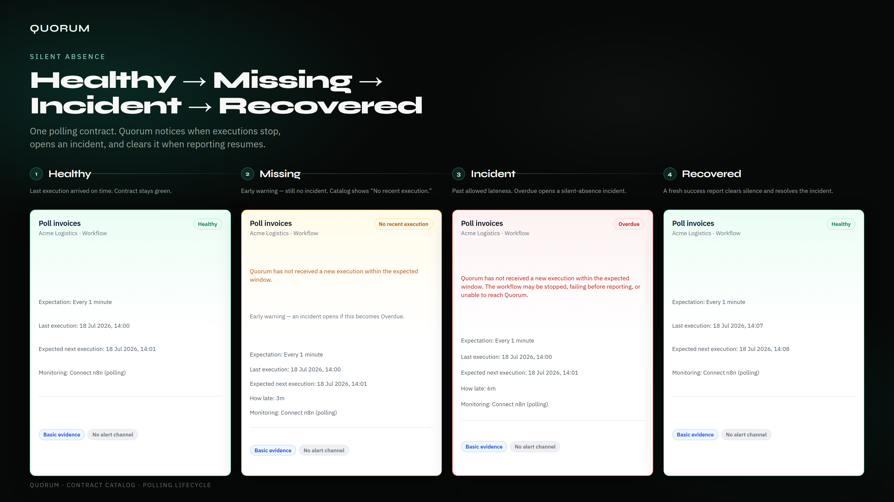

# Example: Poll invoices (polling silent absence)

This is the lifecycle Quorum tests and shows in the beta screenshot: **Healthy → Missing → Incident → Recovered** for a polling contract.

## What it models

An n8n workflow that should report **every 1 minute** (fixed-rate). Quorum polls n8n for executions. When runs stop, the catalog moves through warning and overdue; when a success returns, the silent-absence incident resolves.

| Stage     | Product signal                               | Meaning                              |
| --------- | -------------------------------------------- | ------------------------------------ |
| Healthy   | **Healthy**                                  | Last execution satisfied the cadence |
| Missing   | **No recent execution**                      | Early warning — no open incident yet |
| Incident  | **Overdue** + open `silent_absence` incident | Past allowed lateness                |
| Recovered | **Healthy** again                            | Fresh success cleared silence        |

Covered in automated tests as `Healthy → warning → Overdue → recovered` in `tests/watcher/incidents-outbox-catalog.test.ts` (catalog health does not require an alert channel).

## How to try it yourself

1. Start the lab stack ([getting-started.md](../getting-started.md#local-lab-quorum--n8n)).
2. In n8n, create a simple **Schedule Trigger** workflow (every 1 minute) that does anything cheap — e.g. a Set node — and activate it.
3. In Quorum, open **Set up monitoring**, connect with `http://n8n:5678` + an n8n API key, select that workflow, confirm a **1 minute** expectation, start monitoring.
4. Wait until Catalog shows **Healthy**.
5. **Disable the schedule** (or deactivate the workflow) in n8n.
6. Watch Catalog: **No recent execution** → **Overdue** with a silent-absence incident on **Incidents**.
7. Re-enable / reactivate the workflow and wait for the next run — Catalog returns to **Healthy** and the incident resolves.

No push credential, HMAC secret, or Quorum workflow ID is required for this path.

## Why this example

- Matches the recommended [polling](../push-vs-polling.md) path
- Exercises the core beta promise: notice quiet failure, open one incident, recover cleanly
- Aligns with real n8n validation scenarios in [n8n-validation.md](../n8n-validation.md) (trigger disabled / workflow stops executing)

For signed push reporting instead, use [examples/n8n/quorum-signed-heartbeat.json](../../examples/n8n/quorum-signed-heartbeat.json).
